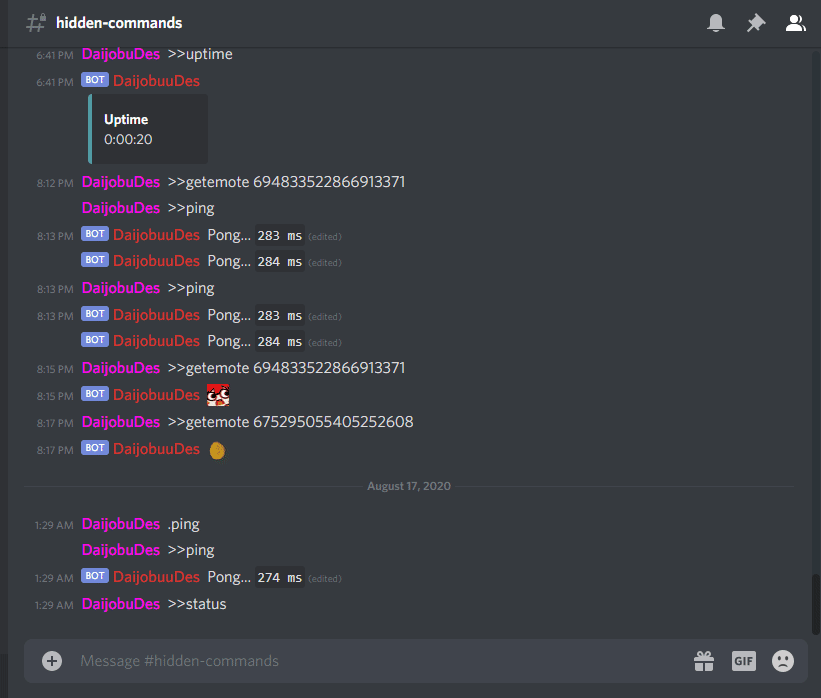

CodeFactor Rating: 

So, I tried a third party code analyzer which grades your code
quality and also checks for issues in the program.
I did not expect that it was an A+ rating.

Well, I've been using `flake8` as my linter on `vscode` in order 
to maintain at least sortableness and also the readability of
the code.

New features are, earthquake updates in the Philippines by
getting sources on the [PHIVOLCS website](https://earthquake.phivolcs.dost.gov.ph/) 
by using `BeautifulSoup` library by web scraping.

A sample GIF to show that it works!

And also, getting the user details and statistics on 
[osu!](https://osu.ppy.sh/home)
